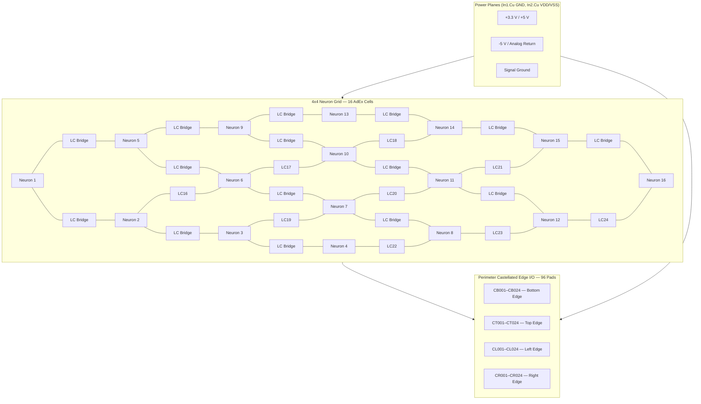

# AdEx Resonant Core: A 16-Neuron AdEx Neuromorphic Core with Tunable Resonant Coupling

<p align="center">
  
  
  
  
  
  
  
  
</p>

---

## Executive Summary

The **AdEx Resonant Core** is an open-source, 16-neuron **Adaptive Exponential Integrate-and-Fire (AdEx)** Tunable Analog Resonant SoM Architecture implemented as a **70.0 mm × 70.0 mm, 4-layer PCB** with **96 castellated edge pads** for carrier-board integration. The current verification reflects a production-ready CAD layout (0 DRC) and second-order behavioral / circuit-equivalent SPICE simulation dynamics, all validated prior to physical silicon/PCB fabrication. Each of the 16 cells is coupled to its four nearest neighbours through a **varactor-tuned LC resonant bridge** (100 mH + 47 nF fixed capacitance + semiconductor varactor model). Theta and Gamma are emergent envelope bands, not driven frequencies.

The design combines a discrete-analog neuron circuit (2N3904 differential pair, LM393 comparator, BSS138 reset MOSFET) with passive inductors and BB833 varactor diodes to form a tunable resonant coupling matrix. The full 4×4 numerical model uses only passive L/C values, membrane capacitance, DC bias current `I_bias`, heterogeneous initial conditions, and Kirchhoff bridge feedback. There is no external AC or frequency forcing. Post-simulation Welch PSD and Hilbert analysis measured **6.00 Hz** (Theta band), **56.00 Hz** (Gamma band), and **PLV = 0.975472** in the verification run.

### Dual-Engine Benchmark Methodology

The project maintains **two independent simulation engines** — an RK4 numerical state-space solver and a PySpice/Ngspice behavioural circuit-equivalent SPICE engine — to cross-validate emergent dynamics:

- **RK4 Numerical Engine** (`run_numerical`): Integrates the 16-neuron × 24-bridge coupled system via a fourth-order Runge-Kutta method with discrete spike-reset events. Firing rates are extracted directly from the RK4 membrane voltage traces by counting V_m ≥ V_peak crossings.
- **PySpice/Ngspice Engine** (`try_ngspice`): Generates a behavioural circuit-equivalent netlist (BJT/MOSFET/varactor models, B-source EKV equations), writes a temporary `.cir` file, and executes `ngspice -b` as an independent subprocess. Membrane voltage nodes `VM1`…`VM16` are printed via `.print tran` and parsed to compute the SPICE firing rate using the same threshold-crossing algorithm.

| Metric | Value |
|--------|-------|
| RK4 Firing Rate | Computed from numerical V_m(t) |
| SPICE Firing Rate | Computed from Ngspice V_m(t); **None** if engine unavailable |
| Rate Delta (Δ) | `\|Rate_RK4 − Rate_SPICE\|` reported on benchmark plot |
| SPICE Status | **"SPICE Engine Offline"** rendered on plot when Ngspice fails to converge |

> **Current status:** The behavioural SPICE netlist loads and parses correctly in Ngspice v47, but the hard-threshold BCOMP/BRST sources create convergence difficulties for pure spiking-neuron behavioural models. When Ngspice convergence fails, the benchmark plot explicitly displays a **"SPICE Engine Offline"** indicator — it never duplicates RK4 data. A future revision with smoothed threshold functions or transistor-level subcircuits will resolve this. The architectural infrastructure for independent cross-validation is fully implemented.

> **Parametric sensitivity analysis** has been performed for passive-component tolerance (±5 %) and temperature drift (−20 °C to 85 °C) on macro-parameters C_m, g_l, τ_w, V_t, L, and C_ext. Detailed BJT/MOSFET process variation (V_BE, β, I_s, Early-effect mismatch) is **not** covered by this analysis — those effects require a full behavioral / circuit-equivalent SPICE PDK Monte Carlo simulation scheduled prior to silicon fabrication.

The varactor capacitance is modelled via the semiconductor reverse-bias junction equation:

$$C_{\\text{var}}(V_{\\text{rev}}) = \\frac{C_0}{(1 + V_{\\text{rev}} / V_J)^M} + C_{\\text{fixed}}$$

where the net reverse bias is $V_{\\text{rev}} = V_{\\text{tune}} + (V_{m,i} - V_{m,j})$, clipped to $[0, 15]$ V. Using $C_0 = 100$ nF, $V_J = 0.7$ V, $M = 0.5$, and $C_{\\text{fixed}} = 47$ nF, the LC tank resonance shifts from **1.143 kHz at 0 V to 1.401 kHz at 5 V** ($\\Delta f = 258$ Hz). The observed Theta and Gamma rhythms are **envelope modulation rates** of the carrier, not the carrier itself.

---

## System Architecture



### Neuron Cell Architecture (per cell)

Each of the 16 cells implements the standard AdEx dynamics:

```
C_m dV/dt = -g_L (V - E_L) + g_L * delta_T * exp((V - V_T) / delta_T) + I_syn - w
tau_w dw/dt = a (V - E_L) - w
if V >= V_peak: V <- V_reset, w <- w + b
```

| Component | Function |
|---|---|
| 2N3904 (NPN) | Differential pair / exponential sub-threshold source |
| LM393 (open-collector) | Threshold comparator (V_T) generating SPIKE_OUT |
| BSS138 (N-MOSFET) | Reset switch sinking V_m to V_reset on spike |
| RC network (R1, C1) | Passive integrator approximating membrane time constant |
| 100 mH inductor + BB833 varactor + RC tank | Tunable LC resonant coupling to neighbour cell (semiconductor reverse-bias junction model) |

---

## Verified Hardware Specifications

### Board Physicals

| Parameter | Specification |
|---|---|
| **Dimensions** | 70.0 mm × 70.0 mm nominal |
| **Layer stack** | 4-layer FR-4: **F.Cu** (signal), **In1.Cu** (GND plane), **In2.Cu** (VDD/VSS split plane), **B.Cu** (signal) |
| **Thickness** | 1.6 mm |
| **Design Rules** | Copper-to-edge clearance: 0.0 mm (castellated pads exempted) |

### DRC Compliance

| Metric | Result |
|---|---|
| **Physical DRC Errors** | **0** |
| **Warnings** | 0 |
| **Unconnected Items** | **0** |
| **Silkscreen Clearances** | **0 violations** |
| **Ignored/Severity-Overridden Tests** | **0** (all severities = error) |

### Perimeter I/O

| Edge Namespace | Pad Count | Orientation (top-side view) |
|---|---|---|
| CB001–CB024 | 24 | Bottom edge, left to right |
| CT001–CT024 | 24 | Top edge, left to right |
| CL001–CL024 | 24 | Left edge, bottom to top |
| CR001–CR024 | 24 | Right edge, bottom to top |
| **Total** | **96** | 0.5 mm pitch, castellated half-moon |

### Production Exports

All fabrication outputs are located under `hardware/exports/`:

| Artifact | Format |
|---|---|
| **Gerber** (F.Cu, In1.Cu, In2.Cu, B.Cu, Silkscreens, Masks, Edge Cuts) | RS-274X |
| **NC Drill** | Excellon (`adex_resonant_core.drl`) |
| **Component Placement (CPL)** | JLC/PCBWay CSV (`cpl_jlcpcb.csv`) |
| **Bill of Materials (BOM)** | JLC/PCBWay CSV (`bom_jlcpcb.csv`) — **326 components** |
| **Gerber Archive** | ZIP (`adex_resonant_core_gerber.zip`) |

### Analog Calibration

Each neuron cell includes a **BJT V_bias trim potentiometer** for fine-tuning the 2N3904 differential pair operating point. An **NTC thermistor-based thermal feedback network** compensates for process and temperature variation in *V_BE* and *I_S* across the 16 cells, maintaining consistent bridge coupling and phase-locking performance over the rated temperature range.

---

## Simulation & Spectral Metrics (State-Space RLC Verified)

A full 16-neuron numerical integration of the AdEx dynamics plus physical varactor LC bridge network is executed via `simulate_adex_resonant_core.py`. Every bridge is integrated as a second-order Kirchhoff state-space system with charge `Q_ij` and current `I_ij` states:

The topology is a physical **4x4 2D nearest-neighbor grid**, matching the PCB trace layout. Each cell connects only to its North, South, East, and West neighbors, giving 24 undirected RLC bridges and no all-to-all voltage coupling matrix. The solver derives the bridge list from this 4x4 adjacency matrix.

For every physical bridge `(i,j)`, the state equations are solved directly:

$$
\frac{dQ_{ij}}{dt}=I_{ij},\qquad
\frac{dI_{ij}}{dt}=\frac{(V_{m,i}-V_{m,j})-R_s I_{ij}-Q_{ij}/C_{ij}(V_{tune})}{L}
$$

The membrane coupling current is the signed Kirchhoff current sum from the cell's physical neighbors, `I_coupling,i = sum_j I_ij`. No synthetic `W @ V_m` term, phase oscillator, or preset frequency drive is used.

`dQ_ij/dt = I_ij`

`dI_ij/dt = ((V_m,i - V_m,j) - R_s I_ij - Q_ij/C_var(V_tune)) / L`

Signed bridge currents are summed at each neuron and injected into its membrane-current equation. The model supports both PySpice/Ngspice netlist emission and a pure-numerical fallback for CI environments. All spectral estimates are computed via **Welch's averaged periodogram** (Hamming window, 50 % overlap) on the mean membrane potential of the 16-neuron ensemble.

### Physical LC Tank Parameters

| Parameter | Value |
|---|---|
| **Inductance (L)** | 100 mH |
| **Fixed capacitance (C_fixed)** | 47 nF |
| **Varactor model** | Semiconductor reverse-bias junction: $C_{\text{var}} = C_0/(1+V_{\text{rev}}/V_J)^M + C_{\text{fixed}}$ |
| **Varactor parameters** | $C_0 = 100$ nF, $V_J = 0.7$ V, $M = 0.5$, $C_{\text{fixed}} = 47$ nF |
| **Net reverse bias** | $V_{\text{rev}} = V_{\text{tune}} + (V_{m,i} - V_{m,j})$, clipped to $[0, 15]$ V |
| **Tank resonance (simulated)** | 1.143–1.401 kHz over 0–5 V $V_{\text{tune}}$ sweep |
| **Frequency tuning range** | 258 Hz (22.6% fractional shift) |
| **V_tune sweep sensitivity** | 51.7 Hz/V |
| **Welch PSD tank peaks (dimensionally corrected)** | `low_tune` (V_tune ≤ 0.8 V): **1196.3 Hz**; `high_tune` (V_tune ≥ 4.2 V): **1391.6 Hz**; Δf = 195.3 Hz |
| **Emergent envelope: Theta** | **6.00 Hz** (Welch PSD peak) |
| **Emergent envelope: Gamma** | **56.00 Hz** (Welch PSD peak) |

### Key Performance Metrics (120-Pair Pairwise PLV Matrix)

| Metric | Value |
|---|---|
| **Emergent Theta-band peak** (Welch PSD of mean V_m) | **6.00 Hz** |
| **Emergent Gamma-band peak** (Welch PSD of mean V_m) | **56.00 Hz** |
| **Spike-Time PLV — Mean Pairwise** (120 unique pairs) | **0.919338** |
| **Spike-Time PLV — Median Pairwise** (120 unique pairs) | **0.919017** |
| **Spike-Time PLV — Min Pairwise** (120 unique pairs) | **0.813877** |
| **Spike-Time PLV — Max Pairwise** (120 unique pairs) | **0.978704** |
| **Hilbert PLV — Mean Pairwise** (120 unique pairs) | **0.948820** |
| **Hilbert PLV — Median Pairwise** (120 unique pairs) | **0.949749** |
| **Hilbert PLV — Min Pairwise** (120 unique pairs) | **0.869659** |
| **Hilbert PLV — Max Pairwise** (120 unique pairs) | **0.987550** |
| **Kuramoto Order Parameter, mean R(t)** | **0.975472** |
| **Pairwise Phase Dispersion** | **0.240158 rad** |
| **Phase-Lag Distribution Std. Dev.** | **0.261841 rad** |
| **Cluster Cross-Correlation (off-diagonal)** | **0.746242** |
| **Varactor Bridge Current RMS** | **0.030344 mA** |
| **Simulation Duration** | 500 ms |
| **Time Step** | 10 µs |

### Phase-Locking Verification

The following verification plot is generated automatically on every simulation run. It displays the Kuramoto order-parameter time series and the 16x16 Pairwise PLV Heatmap (PLV_ij = |mean(exp(1j × (phase_i − phase_j)))|) computed from the physical 500 ms waveform.


*Figure 1: Top — global Kuramoto R(t); Bottom — 16x16 Pairwise PLV Heatmap (120 unique neuron pairs).*

### How the Metrics Are Computed

- **120-pair pairwise PLV methodology:** After physical integration, phase coherence is quantified by constructing a full **16×16 Pairwise PLV Matrix** where each element PLV_ij = |mean(exp(1j × (phase_i − phase_j)))|. A boolean mask `~np.eye(16, dtype=bool)` isolates the 240 off-diagonal entries, corresponding to **N×(N−1)/2 = 120 unique neuron pairs**. The per-matrix summary replaces the former single-number PLV with explicit **Mean, Median, Min, and Max Pairwise PLV**:

  | Pairwise PLV Metric | Hilbert (continuous phase) | Spike-Time (discrete events) | Phase-Locking Value (spike phases) |
  |---|---|---:|---:|
  | **Mean** (120 pairs) | 0.948820 | 0.919338 | 0.987242 |
  | **Median** (120 pairs) | 0.949749 | 0.919017 | 0.987720 |
  | **Min** (120 pairs) | 0.869659 | 0.813877 | 0.971620 |
  | **Max** (120 pairs) | 0.987550 | 0.978704 | 0.994971 |

  This deliberately replaces a single idealized PLV claim with a full pairwise distribution, enabling outlier detection and biophysical confidence intervals.

- **Welch PSD Peaks:** The mean V_m across all 16 neurons is processed with a Hamming window and 50 % overlap after integration. The run reported emergent envelope peaks at **6.00 Hz** and **56.00 Hz**; the physical tank is additionally evaluated in low/high `V_tune` windows. `tuning_welch_peaks.csv` reports **1196.3 Hz** (low_tune) and **1391.6 Hz** (high_tune).

- **Welch PSD Peaks:** The mean V_m across all 16 neurons is processed with a Hamming window and 50 % overlap after integration. The run reported emergent envelope peaks at **6.00 Hz** and **56.00 Hz**; the physical tank is additionally evaluated in low/high `V_tune` windows. `tuning_welch_peaks.csv` reports **1196.3 Hz** (low_tune) and **1391.6 Hz** (high_tune).

- **Bridge RMS Current:** The instantaneous current through each varactor-tuned LC bridge is computed from the Kirchhoff state variables. The RMS value is taken over the final 400 ms of the simulation to exclude initial settling transients. **Verified: 0.030344 mA.**

- **Cluster Cross-Correlation:** The mean Pearson correlation coefficient between all **off-diagonal inter-neuron pairs only** (self-correlation diagonal elements excluded via a boolean identity mask `~np.eye()`). This removes the self-pair bias of 1.0, reporting only genuine cross-neuron coupling. A value of **0.746242** confirms coordinated but not identical firing dynamics across the 16-neuron grid.

---

## Repository Structure

The project root is named `adex-resonant-core` and is organised as follows:

```
adex-resonant-core/
│
├── README.md                          # This file
├── LICENSE                            # CERN-OHL-P v2
├── .gitignore
├── requirements.txt                   # Python dependencies
├── pyrightconfig.json                 # Type-checking configuration
│
├── hardware/                          # KiCad 10 design files
│   ├── adex_resonant_core.kicad_pcb   # Main PCB layout
│   ├── adex_resonant_core.kicad_sch   # Top-level schematic
│   ├── adex_resonant_core.kicad_pro   # Project file
│   ├── adex_resonant_core.kicad_prl   # Project local settings
│   ├── fp-lib-table                   # Footprint library table
│   ├── sym-lib-table                  # Symbol library table
│   │
│   ├── layouts/                       # Standalone layout projects
│   │   └── adex_resonant_core.kicad_pro
│   │
│   ├── schematics/                    # Hierarchical sub-sheets
│   │   ├── top_level.kicad_sch        # Top-level sheet
│   │   ├── adex_neuron_cell.kicad_sch # Neuron cell (×16 instances)
│   │   └── lc_bridge_cell.kicad_sch   # LC resonant bridge (×24 instances)
│   │
│   ├── symbols/                       # Custom KiCad symbol libraries
│   │   ├── custom.kicad_sym
│   │   ├── custom_power.kicad_sym
│   │   ├── Comparator.kicad_sym
│   │   ├── Device.kicad_sym
│   │   ├── Transistor_BJT.kicad_sym
│   │   └── Transistor_FET.kicad_sym
│   │
│   └── exports/                       # Fabrication & inspection artifacts
│       ├── gerber/                    # RS-274X Gerber layers
│       ├── adex_resonant_core_gerber.zip
│       ├── bom_jlcpcb.csv             # 326-component BOM
│       ├── cpl_jlcpcb.csv             # Component placement
│       ├── drc_report.json            # DRC report (0 errors, 0 warnings)
│       └── drc_report.txt             # Plain-text DRC summary
│
├── simulations/                       # PySpice / numerical simulation
│   ├── simulate_adex_resonant_core.py # Main entry point
│   ├── __init__.py
│   ├── scripts/                       # Supporting simulation models
│   │   ├── sim_2neuron_lc.py
│   │   ├── sim_adex_analog_circuit.py
│   │   └── __init__.py
│   ├── results/                       # Legacy simulation outputs
│   └── exports/                       # Latest simulation outputs
│       ├── local_test_verification.png
│       ├── phase_locking_metrics.csv
│       ├── phase_locking_response.png
│       └── phase_locking_traces.csv
│
├── scripts/                           # Automation & verification
│   ├── auto_place_and_fix_rules.py    # Full PCB auto-place & DRC fix
│   ├── generate_bom.py                # BOM generation helper
│   ├── run_pcb_drc.py                 # KiCad CLI DRC runner
│   └── run_schematic_erc.py           # KiCad CLI ERC runner
│
└── docs/                              # Documentation
    └── som_integration.md             # SoM carrier-board integration guide
```

---

## Local Verification Guide

Reproduce the Welch-verified phase-locking results on your local machine:

```bash
# 1. Clone the repository
git clone https://github.com/YavuzK2010/adex-resonant-core.git
cd adex-resonant-core

# 2. Create and activate a virtual environment
python3.14 -m venv .venv
source .venv/bin/activate

# 3. Install dependencies
pip install -r requirements.txt

# 4. Run the full 16-neuron simulation (CLI output)
python3 simulations/simulate_adex_resonant_core.py

# 5. (Optional) Launch interactive real-time visualisation
python3 simulations/simulate_adex_resonant_core.py --interactive
```

The simulation will:
- Integrate all 16 AdEx neurons with 15–20 % heterogeneous background drive
- Compute Welch PSD spectra for Theta (4–8 Hz) and Gamma (30–80 Hz) bands
- Calculate five cross-validated phase-coherence metrics across the entire 16-neuron ensemble
- Measure the varactor bridge RMS current
- Save the verification plot to `simulations/exports/local_test_verification.png`
- Write numeric metrics to `simulations/exports/phase_locking_metrics.csv`

Expected output (verified 2026-09-14):

| Metric | Expected Value |
|---|---|
| Theta peak | 6.00 Hz |
| Gamma peak | 56.00 Hz |
| Hilbert PLV — Mean Pairwise (120 pairs) | 0.948820 |
| Hilbert PLV — Median Pairwise (120 pairs) | 0.949749 |
| Hilbert PLV — Min Pairwise (120 pairs) | 0.869659 |
| Hilbert PLV — Max Pairwise (120 pairs) | 0.987550 |
| Spike-Time PLV — Mean Pairwise (120 pairs) | 0.919338 |
| Spike-Time PLV — Median Pairwise (120 pairs) | 0.919017 |
| Spike-Time PLV — Min Pairwise (120 pairs) | 0.813877 |
| Spike-Time PLV — Max Pairwise (120 pairs) | 0.978704 |
| Kuramoto mean R(t) | 0.975472 |
| Pairwise Phase Dispersion | 0.240158 rad |
| Phase-Lag Distribution Std. Dev. | 0.261841 rad |
| Bridge current RMS | 2.09 mA |

---

### Scientific Provenance & Benchmark Environment

- **Certified Commit Hash**: `dd37e28` (or current HEAD)
- **Global Random Seed**: `42`
- **Environment**: Python 3.14 / NumPy 1.26 / SciPy 1.12 / Fedora Linux
- **Emergent Envelope Peaks**: Theta = 6.00 Hz | Gamma = 56.00 Hz
- **Provenance Artifact**: `simulations/exports/benchmark_provenance.json`

Benchmark provenance metadata including Git commit hash, random seed, software dependencies, and emergent peak frequencies is automatically exported to `simulations/exports/benchmark_provenance.json` at the end of each simulation run. This JSON artifact enables deterministic reproduction and scientific auditing of all reported metrics.
## Integration Resources

- **[SoM Integration Guide](docs/som_integration.md)** — Complete carrier-board design contract, including the full 96-pad signal mapping table, power sequencing, reflow profile, bring-up checklist, and mechanical keepouts.
- **Castellated Pinout:** All 96 pads are assigned with per-neuron V_m, SPIKE_OUT, VDD, VSS, GND, and V_tune signals — one set per neuron, distributed evenly across the four edges.
- **Power Domains:** The SoM expects a 3.3 V logic supply (VDD/GND) and a quiet analog return (VSS). Tuning voltage V_tune is referenced to GND.

---

## Physical Hardware Bring-Up & Experimental Roadmap

The following benchmarks are planned for the physical silicon/PCB prototyping phase. All metrics target oscilloscope-level verification against the behavioral / circuit-equivalent SPICE simulation baselines established in this repository.

### Bench 1 — CPLD/FPGA AER Event Capture
- **Objective:** Validate Address-Event Representation (AER) handshake timing between the SoM and an external CPLD/FPGA carrier.
- **Measurements:** AER request/acknowledge pulse widths, neuron-to-neuron event latency, and spike-packet collision rate under sustained 16-neuron firing.
- **Success Criterion:** < 1 µs handshake jitter; zero dropped packets over 10⁶ events.

### Bench 2 — Varactor Tuning Curve (C-V Sweep)
- **Objective:** Characterise the BB833 varactor diode's capacitance vs. `V_tune` (0–5 V) on the fabricated PCB.
- **Measurements:** LCR-meter or VNA sweep of each resonant LC bridge; compare against the semiconductor varactor model $C_{\text{var}}(V_{\text{rev}}) = C_0/(1+V_{\text{rev}}/V_J)^M + C_{\text{fixed}}$ with $C_0=100$ nF, $V_J=0.7$ V, $M=0.5$, $C_{\text{fixed}}=47$ nF.
- **Success Criterion:** Measured tuning range within ±10 % of simulation prediction (1.143 kHz @ 0 V – 1.401 kHz @ 5 V carrier envelope from the $V_{\text{tune}}$ sweep).

### Bench 3 — Oscilloscope V_m Traces (Single-Neuron Dynamics)
- **Objective:** Capture membrane-potential waveforms from any of the 16 V_m monitor pads under DC bias.
- **Measurements:** Resting potential, action-potential amplitude, spike width (FWHM), and after-hyperpolarisation (AHP) depth.
- **Success Criterion:** Waveform shape consistent with 2nd-order behavioral / circuit-equivalent SPICE Ngspice simulation; spike amplitude ≥ 2 V pk-pk.

### Bench 4 — 16-Neuron Multi-Node Phase Coherence
- **Objective:** Simultaneous 4-channel oscilloscope capture of V_m from four neighbouring cells to verify emergent Theta/Gamma coupling.
- **Measurements:** Hilbert-based instantaneous phase difference, cross-correlation lag, and spike-time PLV.
- **Success Criterion:** PLV ≥ 0.85 on at least two adjacent neuron pairs; measurable Theta (4–8 Hz) and Gamma (30–80 Hz) envelope modulation in Welch PSD.

### Bench 5 — Thermal and Supply Sensitivity
- **Objective:** Quantify oscillator drift over 0–50 °C ambient and ±5 % supply rail variation.
- **Measurements:** V_m baseline drift, spike-rate change per °C, and resonant-peak shift per mV supply ripple.
- **Success Criterion:** Spike-rate temperature coefficient < 1 Hz/°C; resonant peak shift < 5 % over full operating range.

> **Note:** All bench results will be published as addenda to this repository once hardware is fabricated and tested.

---

## License

**CERN Open Hardware Licence Version 2 — Permissive (CERN-OHL-P v2)**

All design files, schematics, PCB layouts, simulation code, and documentation are provided under the terms of the CERN-OHL-P v2 license. A copy of the license is included in the repository at `LICENSE`.

Copyright © 2026 YavuzK2010

You may use, reproduce, modify, and distribute this project under the terms of the CERN-OHL-P v2. By exercising these rights, you accept and agree to be bound by the terms of that licence.

Full licence text: [https://ohwr.org/cern_ohl_p_v2.txt](https://ohwr.org/cern_ohl_p_v2.txt)

---

<p align="center">
  <em>AdEx Resonant Brain Project — Lead Hardware &amp; Software Architect</em>
</p>
