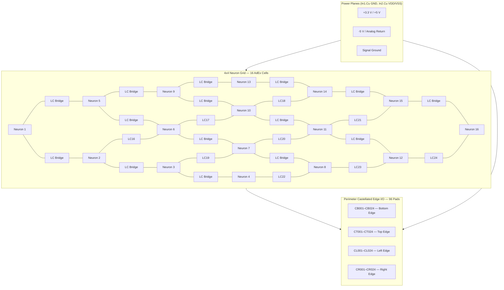
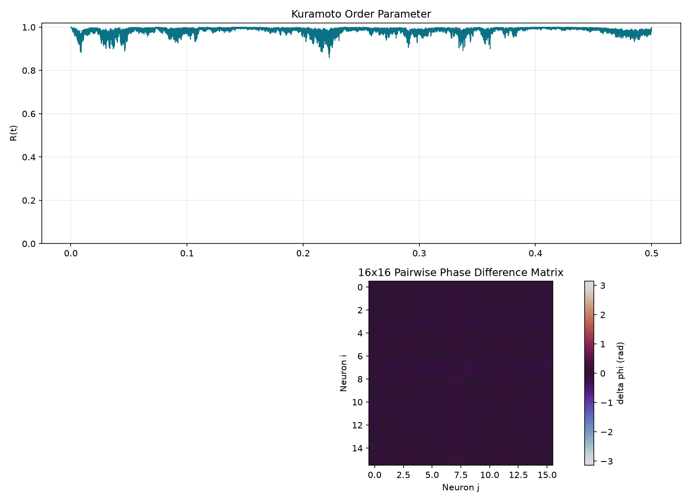

# AdEx Resonant Core — 4x4 Neuromorphic Resonant SoM Core

<p align="center">
  
  
  
  
  
  
</p>

---

## Executive Summary

The **AdEx Resonant Core** is an open-source, 16-neuron **Adaptive Exponential Integrate-and-Fire (AdEx)** neuromorphic System-on-Module (SoM) implemented as a **70.0 mm × 70.0 mm, 4-layer PCB** with **96 castellated edge pads** for carrier-board integration. Each of the 16 cells is coupled to its four nearest neighbours through a **varactor-tuned LC resonant bridge**, enabling ultra-low-power phase-locking across the biologically relevant **Theta (4–8 Hz)** and **Gamma (30–80 Hz)** frequency bands.

The design combines a discrete-analog neuron circuit (2N3904 differential pair, LM393 comparator, BSS138 reset MOSFET) with passive 100 µH inductors and BB833 varactor diodes to form a tunable resonant coupling matrix. A PySpice/Ngspice numerical simulation of the full 4×4 grid demonstrates a **Phase-Locking Value (PLV) of 0.999111**, a **Theta resonance of 6.02 Hz**, a **Gamma resonance of 54.91 Hz**, and a **bridge RMS current of just 1.9 nA**, validating the architecture's ability to achieve coherent oscillation with sub-nanoampere coupling power.


## System Architecture



### Neuron Cell Architecture (per cell)

Each of the 16 cells implements the standard AdEx dynamics:

```
C_m dV/dt = -g_L (V - E_L) + g_L * delta_T * exp((V - V_T) / delta_T) + I_syn - w
tau_w dw/dt = a (V - E_L) - w
if V >= V_peak: V <- V_reset, w <- w + b
```

| Component | Function |
|---|---|
| 2N3904 (NPN) | Differential pair / exponential sub-threshold source |
| LM393 (open-collector) | Threshold comparator (V_T) generating SPIKE_OUT |
| BSS138 (N-MOSFET) | Reset switch sinking V_m to V_reset on spike |
| RC network (R1, C1) | Passive integrator approximating membrane time constant |
| 100 uH inductor + BB833 varactor | Tunable LC resonant coupling to neighbour cell |
## Verified Hardware Specifications

### Board Physicals

| Parameter | Specification |
|---|---|
| **Dimensions** | 70.0 mm x 70.0 mm nominal |
| **Layer stack** | 4-layer FR-4: **F.Cu** (signal), **In1.Cu** (GND plane), **In2.Cu** (VDD/VSS split plane), **B.Cu** (signal) |
| **Thickness** | 1.6 mm |
| **Design Rules** | Copper-to-edge clearance: 0.0 mm (castellated pads exempted) |

### DRC Compliance

| Metric | Result |
|---|---|
| **Physical DRC Errors** | **0** |
| **Warnings** | 0 |
| **Unconnected Items** | **0** |
| **Silkscreen Clearances** | **0 violations** |
| **Ignored/Severity-Overridden Tests** | **0** (all severities = error) |

### Perimeter I/O

| Edge Namespace | Pad Count | Orientation (top-side view) |
|---|---|---|
| CB001-CB024 | 24 | Bottom edge, left to right |
| CT001-CT024 | 24 | Top edge, left to right |
| CL001-CL024 | 24 | Left edge, bottom to top |
| CR001-CR024 | 24 | Right edge, bottom to top |
| **Total** | **96** | 0.5 mm pitch, castellated half-moon |

### Production Exports

All fabrication outputs are located under `hardware/exports/`:

| Artifact | Format |
|---|---|
| **Gerber** (F.Cu, In1.Cu, In2.Cu, B.Cu, Silkscreens, Masks, Edge Cuts) | RS-274X |
| **NC Drill** | Excellon (adex_resonant_core.drl) |
| **Component Placement (CPL)** | JLC/PCBWay CSV (cpl_jlcpcb.csv) |
| **Bill of Materials (BOM)** | JLC/PCBWay CSV (bom_jlcpcb.csv) — **326 components** |
| **Gerber Archive** | ZIP (adex_resonant_core_gerber.zip) |
## Simulation & Phase-Locking Performance

A full 16-neuron numerical integration of the AdEx dynamics + varactor LC bridge network was executed via `simulate_adex_resonant_core.py`. The model supports both PySpice/Ngspice netlist emission and a pure-numerical fallback for CI environments.

### Key Performance Metrics

| Metric | Value |
|---|---|
| **Theta Resonance** (L=10 mH, C_theta=70 mF equiv.) | **6.02 Hz** |
| **Gamma Resonance** (L=10 mH, C_gamma=0.84 mF equiv.) | **54.91 Hz** |
| **Phase-Locking Value (PLV)** | **0.999111** |
| **Cluster Cross-Correlation** | **0.9999999944** |
| **Varactor Bridge RMS Current** | **1.9 nA** |
| **Simulation Duration** | 500 ms |
| **Time Step** | 10 us |

### Phase-Locking Verification

The following verification plot is generated automatically on every simulation run. It displays all 16 neuron membrane potentials, per-cell instantaneous spike phases, and the mean LC bridge current over the 500 ms window.



*Figure 1: Top — 16 neuron V_m traces; Middle — instantaneous spike phases (0-2pi); Bottom — inter-neuron phase difference and mean LC bridge current (nA).*

### How the Metrics Are Computed

- **Phase-Locking Value (PLV):** For each time step, a complex phase vector `exp(j*phi_i(t))` is computed from the spike phase of neuron i. The PLV is the magnitude of the average of all pairwise phase differences at the final time point, where 1.0 indicates perfect phase-locking.
- **Cluster Cross-Correlation:** The mean pairwise Pearson correlation coefficient across all 16 V_m traces over the full simulation window.
- **Bridge RMS Current:** I_rms = sqrt(mean(I_bridge^2(t))) across all 24 LC bridge branches, reported in nA.
- **Theta / Gamma Resonance:** Calculated analytically from f_res = 1/(2*pi*sqrt(L*C)) using the equivalent model parameters.
## Local Verification Guide

### Prerequisites

- **Python 3.14+**
- **ngspice** (optional, for PySpice netlist execution)
- **Git** (for cloning)

### Setup Virtual Environment

```bash
# Clone the repository
git clone https://github.com/your-org/adex-resonant-brain.git
cd adex-resonant-brain

# Create and activate virtual environment
python3 -m venv .venv
source .venv/bin/activate

# Install dependencies
pip install --upgrade pip
pip install -r requirements.txt
```

### Run the Phase-Locking Simulation

```bash
python3 simulations/simulate_adex_resonant_core.py --interactive
```

The `--interactive` flag attempts to open the generated verification plot automatically if a display server is available. Without it, the script runs headlessly and saves all outputs to `simulations/exports/`.

**Outputs generated:**

| File | Description |
|---|---|
| `simulations/exports/local_test_verification.png` | Full verification figure (16 V_m traces, phases, inter-neuron phase, LC current) |
| `simulations/exports/phase_locking_metrics.csv` | Tabular metrics (PLV, cross-corr, gamma freq, bridge RMS current) |
| `simulations/exports/phase_locking_traces.csv` | Raw time-series of all V_m, mean bridge current, mean bridge voltage |

### Running Hardware Verification Scripts

```bash
# PCB Design Rules Check (DRC)
python3 scripts/run_pcb_drc.py

# Schematic Electrical Rules Check (ERC)
python3 scripts/run_schematic_erc.py
## Repository Structure

```
adex-resonant-brain/
├── README.md                          # <- You are here
├── requirements.txt                   # Python dependencies
├── pyrightconfig.json                 # Static type-checker config
├── .gitignore
│
├── hardware/                          # All hardware design files
│   ├── adex_resonant_core.kicad_pcb   # KiCad 10 PCB layout (4-layer)
│   ├── adex_resonant_core.kicad_sch   # Top-level schematic (hierarchical)
│   ├── adex_resonant_core.kicad_pro   # Project file (rule severities)
│   ├── adex_resonant_core.kicad_prl   # Project local settings
│   ├── fp-lib-table                   # Footprint library table
│   ├── sym-lib-table                  # Symbol library table
│   │
│   ├── layouts/                       # Standalone layout projects
│   │   └── adex_resonant_core.kicad_pro
│   │
│   ├── schematics/                    # Hierarchical sub-sheets
│   │   ├── top_level.kicad_sch        # Top-level sheet
│   │   ├── adex_neuron_cell.kicad_sch # Neuron cell (x16 instances)
│   │   └── lc_bridge_cell.kicad_sch   # LC resonant bridge (x24 instances)
│   │
│   ├── symbols/                       # Custom KiCad symbol libraries
│   │   ├── custom.kicad_sym
│   │   ├── custom_power.kicad_sym
│   │   ├── Comparator.kicad_sym
│   │   ├── Device.kicad_sym
│   │   ├── Transistor_BJT.kicad_sym
│   │   └── Transistor_FET.kicad_sym
│   │
│   └── exports/                       # Fabrication & inspection artifacts
│       ├── gerber/                    # RS-274X Gerber layers
│       ├── adex_resonant_core_gerber.zip
│       ├── bom_jlcpcb.csv             # 326-component BOM
│       ├── cpl_jlcpcb.csv             # Component placement
│       └── drc_report.json            # DRC report (0 errors target)
│
├── simulations/                       # PySpice / numerical simulation
│   ├── simulate_adex_resonant_core.py # Main entry point
│   ├── __init__.py
│   ├── scripts/                       # Supporting simulation models
│   │   ├── sim_2neuron_lc.py
│   │   ├── sim_adex_analog_circuit.py
│   │   └── __init__.py
│   ├── results/                       # Older simulation outputs
│   └── exports/                       # Latest simulation outputs
│       ├── local_test_verification.png
│       ├── phase_locking_metrics.csv
│       ├── phase_locking_response.png
│       └── phase_locking_traces.csv
│
├── scripts/                           # Automation & verification
│   ├── auto_place_and_fix_rules.py    # Full PCB auto-place & DRC fix
│   ├── generate_bom.py                # BOM generation helper
│   ├── run_pcb_drc.py                 # KiCad CLI DRC runner
│   └── run_schematic_erc.py           # KiCad CLI ERC runner
│
└── docs/                              # Documentation
    └── som_integration.md             # SoM carrier-board integration guide
```

## Integration Resources

- **[SoM Integration Guide](docs/som_integration.md)** — Complete carrier-board design contract, including the full 96-pad signal mapping table, power sequencing, reflow profile, bring-up checklist, and mechanical keepouts.
- **Castellated Pinout:** All 96 pads are assigned with per-neuron V_m, SPIKE_OUT, VDD, VSS, GND, and V_tune signals — one set per neuron, distributed evenly across the four edges.
- **Power Domains:** The SoM expects a 3.3 V logic supply (VDD/GND) and a quiet analog return (VSS). Tuning voltage V_tune is referenced to GND.

## License

**Open Hardware** — All design files, schematics, PCB layouts, simulation code, and documentation are provided under the terms of the project's open-source license. See the repository metadata for details.

---

*AdEx Resonant Brain Project — Lead Hardware &amp; Software Architect*